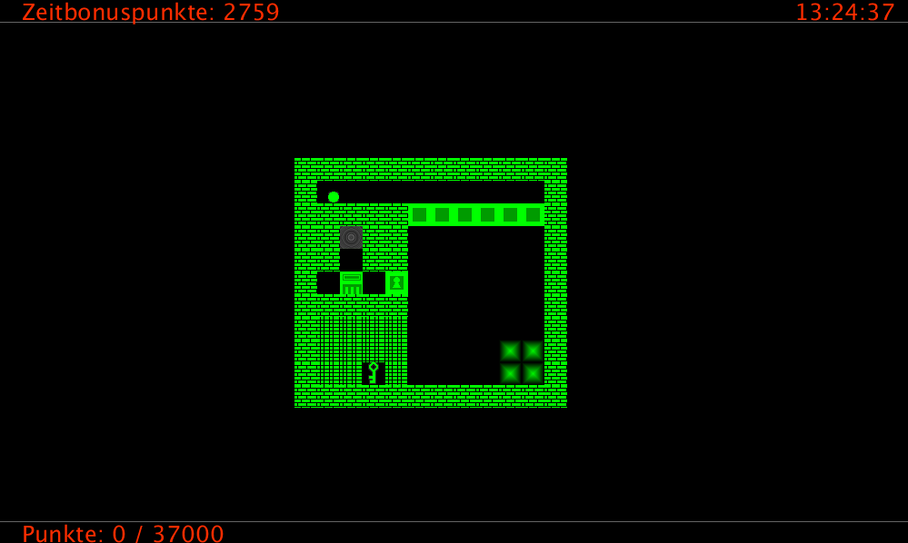
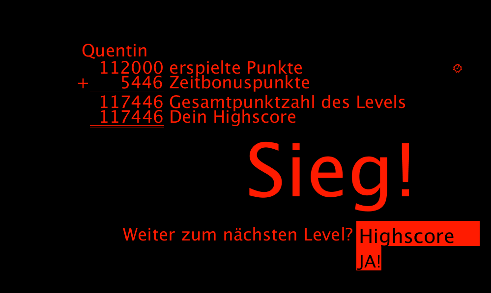
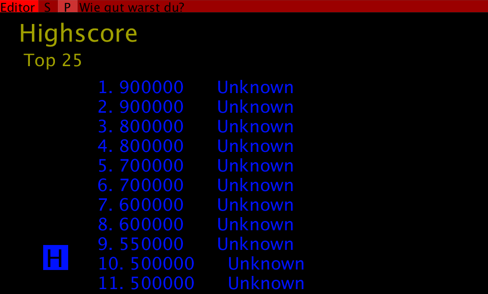
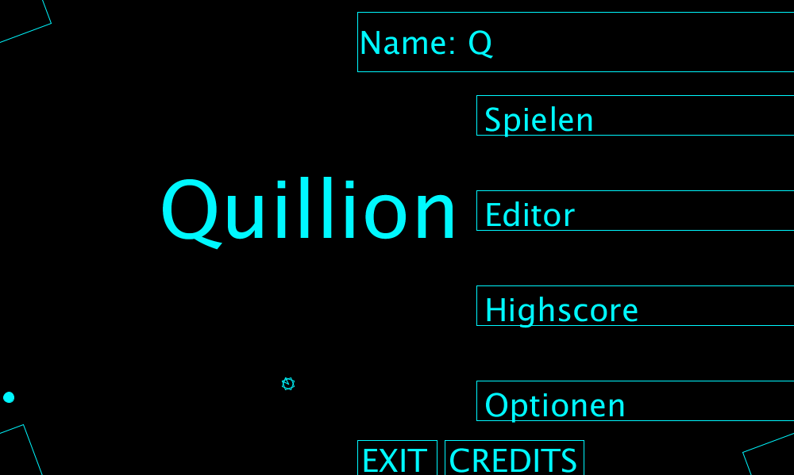

## Anhang

### Anlage 1

1.Menüliste

​      0     - Hauptmenü

​      1     - Editor

​            11    - Lade- Menü

​            12    - Optionsmenü

​            13    - Highscore

​      2     - passiver Spielmodus

​            21    - aktiver Spielmodus

​                  211   - Eigene Level - Lade- Menü

​                  212   - Challenge Level - Lade- Menü

​            22    - Spielmodus

​            23     - Todesbildschirm

​      3     - Namensauswahl

​      4     - Farbauswahl

​      5     - Credits

### Anlage 2

#### Abbildung 1

#### Abbildung 2

#### Abbildung 3

#### Abbildung 4

 