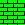
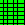
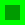

# Quillion - Dokumentation

**Name des Verfassers: Buck Ubel **

## Inhaltsverzeichnis

[1. Vorwort](##Vorwort)

[2. Spielprinzip](##2.Spielprinzip)

[2.1 Objektarten](###2.1 Objektarten)

[2.2 Das Spielfeld](###2.2 Das Spielfeld)

[3. Menüstruktur](##3.Menüstruktur)

[3.1 Editor](###3.1 Editor)

[4. Entwicklung des Programmes](##4.Entwicklung des Programmes)

[5. Grenzen und Fehler des Programmes](##5.Grenzen und Fehler des Programmes)

[6. Erweiterungen und zukünftige Ideen](##6.Erweiterungen und zukünftige Ideen)

[7. Nachwort](##7.Nachwort)

---

## Vorwort

Ich habe mich entschieden, dass Programm Quillion mit Processing zu entwickeln, da ich ein Fan des Spieles Crillion bin. Dieses ist 1988 zum ersten Mal für den Commodore 64 erschienen, wurde von Oliver Kirwa entwickelt und gehört zum Genre Breakout oder auch Logik. Im damaligen Spiel wurden die im Editor erstellten Levels auf einer Diskette gespeichert und konnten somit auch schon damals gespeichert und weitergegeben werden. Meine Eltern erzählten mir, dass der C64 ihr erster Computer war und damals darauf Crillion gespielt haben. Nach dieser Geschichte habe ich mir einen Crillion-Klon für den PC besorgt und war davon begeistert. Es gibt mehrere Klone des Crillion- Spieles für den PC, jedoch empfinde ich "Crillion GPI" als den Besten von diesen. Daher werde ich wenn ich von dem PC - Crillion rede immer den Bezug auf diesen nehmen. Da ich es interessant fand in welcher Form der Editor aufgebaut war, wollte ich einmal selbst solch einen nachprogrammieren. So habe ich einen Klon dieses Crillion- Klons geschrieben. Es gibt jedoch gewisse Unterschiede zwischen meinem Spiel und dem PC- Spiel. Insbesondere Im Editor gibt es unterschiedliche Funktionen, jedoch dazu später mehr.

## 2.Spielprinzip

In Crillion spielt man einen kleinen Ball, der von selbst sich von oben nach unten bewegt. Man kann ihn durch zwei Tasten nach links und nach rechts steuern. Andere Eingriffe in das Spiel kann man eigentlich nicht vollziehen, außer aufzugeben. Jedenfalls ist das Ziel des Spieles alle zerstörbaren Blöcke auf dem Bildschirm zu destruieren und danach in den Zielstein zu gelangen. Die Schwierigkeit liegt hier, aber daran, dass der Ball die selbe Farben haben muss, wie der zu zerstörende Block. Dabei ist zu sagen, dass es insgesamt 12 verschieden Arten von Objekten gibt, von denen 11 in jeweils 8 verschiedenen Farben vorhanden sind. Der Ball wird von jedem Block abgestoßen bis auf den "noHit"- Block. Ich werde jetzt nacheinander die einzelnen Funktionen bzw. Eigenschaften des jeweiligen Objektes erklären. Die eingefügten Bilder sind nur ein Paradebeispiel, denn jedes von Ihnen, bis auf den Zielstein, ist noch in anderen 7 Farben vorhanden.

### 2.1 Objektarten

  Dieses Objekt ist der Ball. Er bewegt sich wie schon erwähnt alleine auf der y- Richtung auf und ab. Für Änderungen auf der x- Richtung ist eine Eingabe des Spielers notwendig. Er kann 8 verschiedene Farben annehmen: Schwarz, Hellgrün, Dunkelbau, Orange, Hellblau, Rot, Dunkelgrün, und Gelb. Der Ball kann im Spiel seine Farbe nur durch so genannte Farbwechsler ändern:

.png)   Dieses Objekt ist der feste Farbwechsler. Wenn man mit dem Ball gegen solch einen stößt, dann wird die Farbe des Balles zu der, des Farbwechslers geändert. Zum Beispiel kommt ein roter Ball auf diesen grünen Farbwechsler wird der Ball grün gefärbt.

.png)   Dieses Objekt ist der variable Farbwechsler. Wenn man mit dem Ball gegen solch einen stößt, dann wird die Farbe des Balles mit der des Farbwechslers getauscht. Zum Beispiel kommt ein gelber Ball auf diesen grünen Farbwechsler dann wir der Ball grün gefärbt. Währenddessen wird jedoch der Farbwechsler gelb gefärbt. Bei einem wiederholten Stoß kann dann die Farbe wieder zurückgeändert werden.

   Dieses Objekt ist die Mauer. Wenn man mit dem Ball gegen solch eine stößt, dann passiert eigentlich nichts, bis darauf das der Ball wie gewohnt abprallt. Hier ist die Farbe egal, denn jeder Ball, unabhängig von der Farbe, wird von jeder Mauer abgeprallt.

   Dieses Objekt ist der noHit- Block. Wenn man mit dem Ball gegen solch einen stößt, dann wird dieser zerstört, der Spieler bekommt 1000 Punkte und das Feld ist danach für den Ball frei passierbar. Hier muss man darauf achten, dass die Farbe übereinstimmt. Wenn dies nicht der Fall ist reagiert dieses Feld als Mauer. Dies ist das einzige Objekt von dem der Ball nicht abprallt.

   Dieses Objekt ist der oneHit- Block. Wenn man mit dem Ball gegen solch einen stößt, dann wird dieser in einen noHit- Block verwandelt und der Spieler bekommt 1000 Punkte. Hier muss man ebenfalls aufpassen, dass die Farbe des Balles und des Blockes übereinstimmt. Wenn dies nicht der Fall ist reagiert dieses Feld als Mauer.

   Dieses Objekt ist der twoHit- Block. Wenn man mit dem Ball gegen solch einen stößt, dann wird dieser in einen oneHit- Block umgewandelt und der Spieler bekommt 1000 Punkte. Hier muss man ebenfalls aufpassen. dass die Farbe des Balles und die des Blockes übereinstimmt. Wenn dies nicht der Fall ist reagiert dieses Feld als Mauer.

.png)   Dieses Objekt ist der Schlüssel. Wenn man mit dem Ball gegen solch einen stößt, dann wird dieser eingesammelt und das Schlüsselguthaben steigt um 1 nach oben. Nach dem Berühren dessen, verschwindet er, der Spieler erhält 1000 Punkte und das Feld ist danach frei passierbar. Man kann diesen, jedoch auch nur mitnehmen, wenn die Farbe mit der des Balles übereinstimmt, ansonsten reagiert auch er als Mauer. 

   Dieses Objekt ist das Schloss. Wenn man mit dem Ball gegen solch einen stößt, und das Schlüsselguthaben über dem Wert 0 liegt, dann kann dieses destruiert werden, falls die Farbe mit der des Balles übereinstimmt. Der Spieler erhält im Anschluss 1000 Punkte und verliert einen Schlüsselpunkt. Falls die Farbe nicht übereinstimmt oder kein Schlüssel vorhanden ist reagiert dieses Feld als Mauer.

.png)   Dieses Objekt ist der Tod. Wenn man mit dem Ball gegen solch einen stößt und die Farbe übereinstimmt, stirbt der Spieler und kommt nun in eine Todessequenz, in der der Ball zerstört wird. Danach kommt man in das Highscore- Menü, in dem man je nachdem wie gut man war verewigt wurde. Auch hier gilt, bei Farbungleichheit reagiert das Feld als Mauer.

.png)   Dieses Objekt ist der USB- Block. Wenn man mit dem Ball gegen solch einen stößt und die Farbe übereinstimmt, wird dieser wie eine Kiste verschoben. Jedoch nur, wenn das dahinterliegende Feld frei ist. Ist die Farbe des Balles ungleich der des Blockes, reagiert das Feld als Mauer.

   Dieses Objekt ist der Zielstein. Wenn man mit dem Ball gegen solch einen stößt und man im Vorfeld alle zerstörbaren Blöcke ( noHit, oneHit, twoHit, Schlüssel, Schloss) destruiert hat, kann man so ins Ziel gelangen. Die Ballfarbe ist in diesem Fall komplett nebensächlich und hat keine Auswirkungen. Jedoch reagiert dieses Feld als Mauer, wenn man noch nicht alle zerstörbaren Blöcke destruiert hat.

Dies sind alles Bilder der Elemente der Klasse Rechteck aus der Datei "Quillion_1_0_0_beta.exe" und liegen in dessen "data"- Ordner zum Abruf bereit.  Sie werden im Programm alle mit der Methode "Bildereinlesen2()" hinzugefügt.

### 2.2 Das Spielfeld

Man kann in Abbildung 1 ( siehe Anhang, Anlage 2) ein Level sehen. Man sieht, das oben rechts eine Zeit angezeigt wird, diese steht für die aktuelle Uhrzeit, damit man beim Spielen nicht, dass Zeitgefühl verliert. Oben links ist eine Zeitbonuspunkte Zahl zu erkennen, diese wird beim erfolgreichen Beenden des Spieles dem Punktestand hinzugefügt. Jedoch verkleinert sich diese Zahl pro Zeiteinheit. Unten links kann man eine andere Punkteanzeige sehen, welche links anzeigt, wie viele Punkte man in diesem Level besitzt und rechts anzeigt, wie viele Punkte man braucht um das Level erfolgreich zu beenden. Das eigentliche Spiel baut sich in der Mitte auf. Dort gibt es 880 Felder, die alle einen anderen Zustand haben können und somit andere Objekte auf sich platziert haben. Hier kann man einige Blöcke wieder erkennen, wie den Ball, die Mauer, den noHit-, oneHit- und twoHit- Block, den Schlüssel und das Schloss, den USB- Block so wie den Zielstein. Wenn man jetzt alle Steine destruiert hat und man durch den Zielstein gegangen ist, kommt folgendes Fenster ( Anhang, Anlage 2, Abbildung 2). Hier erkennt man oben die Punktezusammenrechnung, mit den Zeitbonuspunkten, den durch die Zerstörung erspielten Punkten, diese zusammengerechnet und den aktuellen Highscore. Nebenbei ertönt zufällig eines der folgenden zwei Lieder ("We are the champions" - Queens, "Sweet Victory" - David Glen Eisley) zu hören. Dann kann man sich entweder im Highscore verewigen, oder man spielt ein weiteres Level um seine Punktzahl zu erhöhen. Kommt man jedoch im Spiel auf einen Todesstein, dann kommt ein Bildschirm in dem eine Animationssequenz abläuft und ein weiterer in dem da steht, dass man gestorben ist. Anschließend kommt man im Highscore hinaus ( Anhang, Anlage 2, Abbildung 3). Wenn man gut genug war, ist man dort drin verewigt. Dort gibt es einen Button mit einem "H", dieses steht für Hauptmenü. Wenn man dort drauf klickt, kommt man im Hauptmenü heraus  ( Anhang, Anlage 2, Abbildung 4).

## 3.Menüstruktur

In dieser Abbildung sind 7 Menüpunkte zu sehen. Im untersten ("Exit") kann man das Spiel verlassen. In dem rechts neben diesen Button ("Credits") kann man Informationen zum Programm erhalten. In dem obersten Button("Name: ###") steht der Name des aktuellen Spielers, wenn man darauf klickt, kommt man in ein Menü in dem man sich einen anderen Namen auswählen kann bzw. einen eigenen schreiben kann und diesen dann der Liste hinzufügen könnte. Wenn die Liste der Namen bis zum Bildschirmrand reicht, kann man scrollen, sodass andere Namen in der Liste vorkommen. Dort ist auch ein Pfeil verfügbar der einen wieder zurück ins Hauptmenü bringt. Im Hauptmenü gibt es dann noch den Punkt ("Spielen") dort kann man dann seine eigenen editierten Levels spielen oder aber auch im Challenge- Modus spielen in dem dann auch Punkte für den Highscore erspielbar sind. Jedoch sind hier nur so viele Level verfügbar, wie man auch frei gespielt hat. Dieses Untermenü lässt sich durch Pfeile durchklicken und ins Hauptmenü kommt man wieder zurück, wenn man das "H" drückt. Der nächste Punkt im Hauptmenü ist jetzt der Editor. Wenn man in diesen gelangt erkennt man oben eine Menüleiste in der Mitte das Spielfeld mit allen 880 Feldern sowie darin liegend 880 gelben Punkten und unten eine weitere Leiste mit 8 verschiedenen Farben, den 12 verschiedenen Objekten sowie ganz rechts die x und y Position des Mauszeigers. Zu der Funktionsweise der Editors wird in einem anderen Punkt eine Erklärung stattfinden. Wenn man mit der Maus über den Button "Editor" in der oberen Zeile geht, dann öffnet sich ein neues Menü und der Hintergrund verschwindet. Jetzt gibt es hier die Funktionen "Speichern", "Laden", "Optionen", "Hauptmenü" und "Neu". Mit "Speichern" speichern sie das erstellte Level und mit "Neu" können sie den Bildschirminhalt löschen und ein neues erstellen. WICHTIG: Nach dem der Spieler auf "Neu" gedrückt hat, erfolgt keine Abfrage ob dies wirklich passieren soll und somit wird der Bildschirminhalt ohne zu speichern gelöscht. Wenn man auf "Laden" geht wird man in ein neues Menü geschickt in dem man seine eigenen Levels verwalten kann, also zum Laden oder zum Löschen. Im Menüpunkt "Hauptmenü" kommt man wieder zurück ins Hauptmenü und der Menüpunkt "Optionen" im Hauptmenü sowie der selbige in dieser Menüzeile führt zum Optionsmenü. In diesem kann man das Spiel auf seinen Geschmack anpassen. Mit der "Editorumstellung auf Mausrad" verändert man den Editormodus, sodass alle möglichen Objekte unten am Bildschirmrand vorhanden sind und man scrollen muss, wenn man alle Objekte in Sicht nehmen möchte. Dies hat Vorteile beim editieren von bestimmten Levels. Die nächsten beiden ("Steuerung nach links bzw. recht") Optionen stellen klar, ob man mit Pfeiltasten spielen möchte oder mit "A" und "D". Dann kann man entweder Musik anmachen oder Geräusche anschalten. Standardgemäß ist die Musik eingeschalten und der dann laufende Soundtrack ist das Lied "Popcorn" von Hot Butter von 1969. Als letztes kann man die ständige Farbwechslung ausschalten und mit einem Klick auf die Farbskala, sich eine Farbe aussuchen. Ganz am unteren Rand entdeckt man dann noch weitere 4 Bilder, die wenn man sie anklickt zum Hintergrundbild werden. Der Button "H" führt einen wieder ins Hauptmenü. Dort gibt es schließlich noch den Button Highscore, in dessen Menü man eine Bestenliste vorfindet. Diese ganze Struktur wird durch die int -Variable "menue" koordiniert. Je nach dem welchen Wert sie besitzt, dessen zugeordnetes Menü wird angezeigt. Die Überprüfung hierzu findet in der draw()- Methode mit if- Unterscheidungen statt. So wird der Editor angezeigt, wenn menue gleich 1 ist. ( Eine Liste darüber findet man im Anhang, in der Anlage 1.1)

### 3.1 Editor

Der Editor ist eigentlich ziemlich einfach gehalten und ist so mehr oder weniger selbsterklärend. Man wählt unten eine Farbe (links), dann ein Symbol (rechts) und danach klickt man auf einem gelben Punkt. Dies kann man mit allen Element beliebig oft wiederholen. Jedoch kann es nur einen Ball geben, somit verschwindet ein früherer Ball wieder, wenn man einen neuen setzt. Jedes Level sollte einen Zielstein besitzen, da ohne einen solchen das Level nicht zu gewinnen ist und man aufgeben muss in dem man "Backspace" drückt. Man kann so hier auch lustige Bilder malen durch die Vielzahl der Farben, oder aber auch Level, die anspruchsvoll sind von der Logik, da man überlegen muss was man zuerst macht. Denn die Schwierigkeit in den Levels besteht darin, nicht gleich loszustürmen, sondern zu erkennen, wann man welche Farbe tauschen muss bzw. welche Kiste man bewegt. So kann es kommen, dass beim Testspiel eine aussichtslose Situation entsteht, in der man aufgeben muss. Wenn man jedenfalls ein Level kreiert hat, überprüft hat ob der Zielstein da ist, genug Schlüssel für die Schlösser vorrätig sind, dann kann man in der Menüleiste (oben- links) auf "Speichern" drücken. So wird der Bildschirminhalt gelöscht und im Lade- Menü ist ein neues Level spielbar. Falls, dieses nicht mehr notwendig ist, kann man durch einen Klick auf "Löschen" und auf das jeweilige Level, nach einer Sicherheitsabfrage dieses auch wieder löschen. WICHTIG: Die Level- Namen rutschen nach. Also wenn man z.B. sechs Level hat und Level 4 löscht, dann wird Level 5 zu Level 4 und Level 6 zu Level 5. Level 6 ist dann nicht mehr zu sehen, ist jedoch in Level 5 enthalten und Level 5 steckt in Level 4.

## 4.Entwicklung des Programmes

Wie schon am Anfang geschrieben habe ich dieses Programm mit der Programmiersprache Processing geschrieben. Dies ist eine objektorientierte, stark typisierte Sprache und eine Untergruppe von Java. Sie enthält eine integrierte Entwicklungsumgebung mit kurzer Kompilierzeit und ist vor allen auf den Bereich Grafik, Simulation und Animation spezialisiert. Da wir diese im Unterricht behandelt hatten, seit dem Jahr 2013, bot sich an diese zu verwenden. Daher fing ich am 12.12.2015 an mir Gedanken zu diesem Projekt zu machen und fing an ein kleines Programm zu schreiben, indem ich versucht habe einen Ball zu erstellen, der von oben und unten abprallt. Danach habe ich eine Klasse Rechteck erstellt um dort das sichere Abprallen an den Seiten eines zufällig generierten Rechteckes zu gewährleisten. Dann fing ich an die Bilder (siehe 2.1 Objektarten) mit dem Programm Paint in Zusammenarbeit mit Processing zu erstellen und einzubinden. So konnte ich als Erstes das Editormenü erstellen. Nach und nach habe ich angefangen die Aktionen der Menüpunkte der Menüleiste anzufertigen. So kam erst eine Speicherfunktion dazu, die von jedem Element, welches auf dem Spielfeld editiert wurde, eine Zahl übertragen bekommen hat und diese danach in eine Textdatei gespeichert hat. Diese Zahl ist bei mir die Variable "bpos". Sie kann von 0 bis 98 jeden natürlichen Wert annehmen. So stehen zum Beispiel die Werte 91 bis 98 für einen Ball, aber andererseits die Werte von 16 bis 23 für eine Mauer. Die Spanne für ein Objekt ist immer acht groß, da es acht verschiedene Farben gibt. Außer wie schon erwähnt bei dem Zielstein. So ist, ein Element der Rechteckklasse im Spiel leer, wenn die bpos gleich 81 ist. Im Editor wird dieser Fall dann mit einem gelben Punkt gekennzeichnet bzw. wenn man mit der Maus darüber fährt mit einem blauen. Die Zahl 99 ergibt sich aus den 80 verschiedenen Blockarten, dem Zielstein, einem leeren Feld(81), einem informationslosem Feld (82; kommt nicht vor), den 8 Farbsteinen (diese können allerdings nicht gesetzt werde), und den 8 Bällen. Das, danach folgende, erst noch einfache, Lade- Menü konnte dann solch eine Textdatei aufarbeiten und die bpos auf jedes Objekt der Rechteckklasse übertragen, so dass dann dasselbe "Bild" entstand wie zuvor gespeichert worden ist. Anfangs gab es bei diesem Vorgang kleine Probleme, da verschieden Objekte einfach verschwanden oder durch andere ersetzt wurden sind. Nachdem dieses Problem dann ausgebessert wurde, in dem man vor dem Laden alle Elemente zurück auf Ausgangssituation setzte, habe ich die "Neu" - Funktion hinzugefügt, mit der man den Bildschirm gleich zurücksetzen konnte. Dies war der Zustand der Datei "Quillion_0_3_0.pde" (Prototyp 1). Danach fügte ich nacheinander  die einzelnen Funktionen, welche die verschiedenen Objekte ausführen bzw. hervorrufen sollte, hinzu. (Nachzulesen in 2.1 Objektarten) Dazu liest die Methode "eigen()" der Klasse Rechteck die int- Variable bpos und überprüft über mehrere Fallunterscheidungen in Kombination mit for- Schleifen, welche Art vorliegt und passt so dessen Variablen an. Dabei ist die int- Variable "start" sehr wichtig, da sie angibt ob gerade gespielt wird oder pausiert wird. Denn die Eigenschaften müssen immer unter diesen zwei Gesichtspunkten dargestellt werden. Sonst würde der Ball sich z.B. immer auf und ab bewegen, dies würde für den Editor- Modus eher hinderlich sein. Bei dieser Einbindung aller verschiedener Eigenschaften, gab es vor allem Probleme bei der Kopplung der Ball- Klasse mit dem Rechteck, welches den Ball beinhaltete (also bpos>91). Diese Probleme löste ich, in dem ich die Ball- Klasse in die Rechteck- Klasse als Konstruktor integrierte. Dann überarbeitete ich in der Version_0_3_6 das Lade- Menü, so dass ich die Levelbegrenzung durch den Einsatz des Mausrades beheben konnte und ich jetzt das Löschen einzelner Level bewerkstelligen konnte. Dazu habe ich mir folgendes Einfallen lassen: Da das Löschen von Dateien über Processing schwer umsetzbar für mich war, habe ich eine zweite Text- Datei erstellt, namens "saver.txt". In dieser ist festgeschrieben, wie viele Level angezeigt werden. So wird beim Löschen kein Level gelöscht, aber überschrieben, also werden die Werte von einem höheren Level auf das Level davor geschrieben bis zu dem Level was man löschen möchte. Dieses wird dann logischerweise nicht auf ein anderes überschrieben. So entstehen Dateien im Level- Ordner, auf die man keinen Zugriff im Spiel besitzt. Ein weiteres Problem bestand im Editor jedoch darin, dass der Ball während des Spieles andere Objekte, die er zerstörte oder "wegschob", blockiert und somit aus dem Bildschirm gelöscht hat. Dazu musste ich mehrere lokale "bild" - PImage- Variablen für die Klasse Rechteck erstellen. Diese werden unterschiedlich aktiv, während "bild" und "bild2", die Bilder sind, die im Testspiel angezeigt werden, sind "bild3" und "bild4" für die Speicherung über das Spiel hinweg da, damit nach einem verlorenen, gewonnenen oder aufgegebenen Spiel, wieder die selbe Situation herrscht wie vor dem Spiel. Nachdem Vollenden des Editors, bei dem immer wieder vereinzelt Fehler aufgetreten sind, konnte ich nun fortfahren mit dem anderen Teil des Programmes - dem eigentlichen Spielmodus. Für diesen brauchte ich zum Teil bloß mein schon geschriebenes Lade- Menü geringfügig variieren (Eigene Levels) und dasselbe noch mal etwas stärker variieren damit der Challenge- Mode entstehen konnte. Als Letztes fügte ich noch das Namens- Menü ein, damit man sich im Editor auch verewigen konnte. Nach diesem Akt waren nur noch Kleinigkeiten und Anpassungen notwendig.  Als kleines Extra habe ich noch mit der minim- Bibliothek Musik eingebunden, sodass das Spaßfaktor erhöht wird. (Ein genauer Plan über die Änderungen des Programmes kann man im Anhang in der Anlage 1.2 finden) Natürlich ist kein Spiel bzw. Programm perfekt und so hat auch dieses seine Grenzen und Fehler.

## 5.Grenzen und Fehler des Programmes

Als ich z.B. die Musik einbinden wollte, gab es ein kleines Problem, wenn ich die Geräusche und die Musik gleichzeitig parallel an geschalten lassen wollte. Denn immer wenn ein Geräusch abgespielt wurde, ist die Musik verzerrt wurden. Ich versuchte dies erst mit einer zweiten Minim- Klasse zu beheben, jedoch erfolglos. Daher musste ich die beiden Funktionen von einander trennen, so dass der Spieler nur eines von beiden anschalten kann. Ein weiterer Punkt ist, dass ich einige Grafikfehler im Editor nicht beheben konnte. So kommt es vor, dass wenn man Blöcke zerstört, einzelne nach dem pausieren nicht mehr angezeigt werden, aber wenn man wieder das Spiel startet sind sie wieder da. Somit ist dies wohl eine Grenze, aber bei einem einfachen "Start" und "Pause" Drücken ist dieses Problem auch nicht mehr wirklich schwerwiegend Ein Extremtest hat auch gezeigt, dass wenn man das Spiel lange spielt bzw. viele Level hintereinander erstellt, dass es stehen bleibt und nicht mehr reagiert. Um das Problem zu beheben ist ein Programmstart erforderlich. Dieser ist auch notwendig, wenn man einen Namen, der Namensliste im Namens- Menü hinzufügen möchte. Denn wenn man auf "Der Liste Hinzufügen" klickt, passiert augenscheinlich nichts, jedoch wird im Hintergrund der Name und dessen Länge in die Datei "namen.txt" übertragen. Eine weitere Grenze liegt in der Bewegung des Balles, denn wenn man schnell die Bewegung von links nach rechts oder anders herum wechseln möchte bleibt der Ball kurze Zeit stehen, da die Pixelanzahl, die auf der einen Seite hinzugezählt werden, und die Pixelanzahl, die auf der anderen Seite abgezogen werden, gleich sind und miteinander subtrahiert null ergeben. Die Änderung der x- Koordinate um null Pixel, äußert sich durch einen Stillstand. Ein Fehler existiert noch im Optionsmenü, bei der Auswahl einer bestimmten Farbe. Beim wieder Ausschalten dieser Funktion bleibt meist die Farbe die selbe bzw. ändert sich kurz und bleibt dann stehen. Dies liegt daran, dass die Funktion "farbwechsler()" nur funktioniert, wenn einer der drei Werte (R,G,B) anfangs 255 ist und die anderen beiden null.

## 6.Erweiterungen und zukünftige Ideen

Einige Grenzen habe ich allerdings mir selbst gesteckt, da dieses Programm noch umfangreicher hätte sein können. Bei einem Klon eines Klons, ist eigentlich klar, welche Erweiterungen noch beinhaltet werden können. Da mein Programm nicht so umfangreich ist, wie der am Anfang besprochene Klon, kann man dort anfangen. Zuerst würde ich noch weitere Objekte mit einbauen, dafür müsste man lediglich ein paar Zahlen verändern, damit deren "bpos" gelesen und gespeichert werden kann. Weiterhin müsste man dann neue Eigenschaften und Methoden für diese Ausarbeiten. So könnte man die Todesschrauben des Spieles "Crillion GPI" noch mit hineinbringen. Für diese müsste man dann jedoch eine spezielle Eigenschaft erstellen, dass sie sich von selbst bewegen können und ähnlich wie der Ball von Mauern oder Ähnlichem abgestoßen werden. Danach bräuchte es noch eine Überprüfung dafür, dass falls der Ball und diese Schraube sich berühren, der Ball stirbt. Ein weiteres, denkbares Objekt wäre noch die verschließbare Tür. Diese müsste auch noch einen Schalter bekommen und hätte zwei Zustände (offen, geschlossen). somit wäre es einmal durchlässig und einmal undurchlässig. Abgesehen von den Elementen, die schon im Crillion- Klon hinzugefügt wurden sind, könnte man auch Eigene erfinden, die die Spannung im Spiel hält bzw. mehr Überlegungen erfordert. Wie zum Beispiel eine künstliche Intelligenz, welche einen zweiten Ball steuert, der einen verfolgt und bei Berührung den Ball tötet (ähnlich wie Pac- Man). Eine andere Erweiterung liegt in den Prinzipien der Namen. Ich kann mir gut vorstellen, das man für jeden Spieler- Account eine eigene Textdatei zu schreibt. So könnte man abgesehen von einer Leistung im Highscore, auch noch andere Statistiken sehen. So z.B. das beliebteste Level, wie viele Level man bisher gespielt hat, wie viele davon verloren bzw. gewonnen wurden, oder auch wie lang man gebraucht hat für die Challenge. Man kann auch ein Achievement- System mit einführen, bei dem man Auszeichnungen bekommt für bestimmte Taten. Man könnte auch einen Gesamtpunktestand einplanen, von welchem man dann bestimmte Dinge "kaufen" kann. So zum Beispiel ein neues Layout für die Bälle, oder das man den Ball schneller oder langsamer spielen kann. Was unabhängig davon schon möglich ist, ist dass man ein Level aus dem Ordner kopiert und einem Freund bspw. über Email schicken kann, so dass auch dieser das Level spielen kann. Eine andere Variante wäre auch ein Multiplayer, in dem man zu zweit, entweder miteinander oder gegeneinander versucht ein Level an einem PC zu schaffen. Hier könnte ich mir auch eine netzwerkgebundene Variante vorstellen. Man könnte auch verschiedene Spielmodi einführen, da man schon eine Rechteck- Klasse besitzt, ist es leicht andere ältere Spiele nach zu ahmen. So etwa das Spiel "Breakout", welches im April 1974 zum ersten Mal veröffentlich wurde von Atari und kurz darauf für den Apple II verfügbar war. Man müsste einen ähnlichen Editoren entwerfen, ein paar Felder mit bpos gleich 81 kennzeichnen, so dass im unteren Teil des Feldes Platz für das Brett entsteht, danach kann man die Level konstruieren und somit dann beim Starten den Ball vom Brett aus starten. Die Umsetzbarkeit, ist etwas schwierig, da in diesem Falle nicht mehr der Ball von den Tasten gesteuert wird, sondern das Brett. Nach einigen weiteren Fallunterscheidungen im Klasse Ball, denke ich jedoch, dass es möglich ist umzusetzen. Man könnte sogar Tetris hineinbringen. Dafür müsste ein etwas kleineres Spielfeld geschaffen werden, welches schmal nach oben verläuft. So z.B. die Rechtecke von 308 bis einschließlich 549. Es würde eine schmale "Gasse" entstehen, die einem Tetris Feld ähnlich wäre. Man müsste danach eine neue Klasse schreiben, die die Klötze enthält, welche dann nach unten fallen. Es würde garantiert nochmal einen großen Umfang betreffen, jedoch ist der Grundstein für solch Spiele gelegt, da dieses Rechteckmuster beliebt bei Spielen der 70er und 80er war. 

## 7.Nachwort

Zum Abschluss muss ich sagen, dass in meinem Klon von Crillion nicht so viele Elemente existieren, wie in "Crillion GPI", jedoch hat mein Programm einen kleinen Vorteil. Während bei dem anderen Klon es nur 240 Rechtecke gibt, gibt es bei mir fast 4- fach so viele (880). Dadurch gibt es natürlich viel mehr Möglichkeiten, wenn später die restlichen Objekte noch hinzugefügt werden würden. Ich für meinen Teil, hatte sehr viel Spaß beim Programmieren dieses Spieles es hat mir gezeigt wie unglaublich vielseitig schon so ein simples kleines Programm sein kann und wie viele Tücken es bei der Programmierung gibt. Ich genoss die beinahe unbegrenzte Möglichkeit des Programmierens, da man alles was man sich vorstellte auch umsetzen konnte. Manchmal wohl erst mit einer gewissen Überlegungszeit und mit der Suche von Fehlern, aber schlussendlich ergab sich das Resultat, welches ich mir anfangs vorgestellt hatte. Ich werde in Zukunft weiter an diesem Programm in meiner Freizeit schreiben um noch einige der in 6. beschriebenen Funktionen umzusetzen. Schließlich ist die Datei, die ich bisher habe nur eine Beta- Version. Ich übernehme jedoch keinerlei Haftung für, die bei der Benutzung dieses Programms oder einer seiner Komponenten entstehenden Schäden. Für Bughinweise bin ich dankbar und freue mich über kritische Meinungen. Sollte jemand irgendwelche Copyrights oder sonstige Rechte verletzt sehen, bitte ich um eine kurze Rücksprache. Diese ist nicht mit Absicht geschehen und ich werde dann umgehend den Grund der Beanspruchung entfernen. 

 

 
